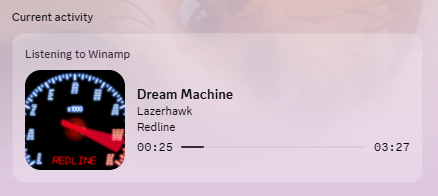

# gen_discord_rpc

A Winamp general purpose plugin that publishes the current track to Discord as a
Rich Presence status - with **album cover art** and a **Spotify-style progress
bar**.



## Why not just use the existing plugins

The existing Winamp RPC plugins ([clandrew/wdrp](https://github.com/clandrew/wdrp),
[jamesdsmith/gen_discordrpc](https://github.com/jamesdsmith/gen_discordrpc)) all
build on Discord's `discord-rpc` C library, which is archived and predates the
API features this needs. They show a static Winamp logo and an elapsed-time
counter. Getting the Spotify look requires three things that library cannot do:

| Feature | How it works |
|---|---|
| **Progress bar** | Send `timestamps.start` **and** `timestamps.end`. With only `start`, Discord renders a count-up timer instead. |
| **"Listening to…"** | Send `activity.type = 2`. RPC permits types 0, 2, 3 and 5; `discord-rpc` has no `type` field at all. |
| **Album art** | Put a plain `https://` URL in `assets.large_image`. The Discord client proxies external URLs through `media.discordapp.net` itself. |

So this plugin talks the Discord IPC protocol directly over its named pipe
(`\\.\pipe\discord-ipc-N`) - about 200 lines, no third-party dependencies.

## How cover art works

The plugin shows **the artwork actually stored in your file**, not a catalogue
guess - so bootlegs, live sets, remixes and self-tagged rips get the right
cover.

Getting there needs one unavoidable step. Discord's *servers* resolve
`assets.large_image`, not the desktop client, so the image must be reachable
from the public internet: a local path, `localhost` or a LAN address cannot
work. The alternatives were considered and rejected:

- **Discord's own asset API** (`POST /applications/{id}/assets`) would be ideal,
  but it needs the application owner's *account* token. A plugin has no business
  holding one.
- **A self-hosted server**, as [foo_cover_upload](https://github.com/0x1f610/foo_cover_upload)
  does - works, but you have to run a server.

So artwork is uploaded to an anonymous host and Discord is handed that URL, the
same route [navidrome's plugin](https://github.com/navidrome/discord-rich-presence-plugin)
takes. Default is **litterbox.catbox.moe with a 72-hour expiry**, so nothing
lingers publicly; Catbox is available if you would rather the URLs never expire.

Resolution order per track:

1. **Artwork in the file** - read via the Windows shell thumbnail provider,
   which already handles FLAC, MP3, M4A, WMA and anything else with a registered
   property handler. That is one code path instead of four hand-written
   ID3/Vorbis/MP4 parsers, and it will not fall over on a malformed tag. A
   `cover.jpg`/`folder.jpg` beside the track is picked up too.
2. **Catalogue lookup** on the iTunes Search API, then Deezer.
3. **The placeholder** (see below).

Covers are downscaled to 512px and re-encoded as JPEG before upload, then cached
by both release *and* image content hash - so an album uploads once no matter
how many of its tracks you play, and identical art shared across releases
uploads once overall. Cached entries carry their expiry and are refreshed an
hour before the host would reap them.

If you would rather nothing from your files ever left the machine, untick **Use
the artwork stored in the file** and it reverts to catalogue lookup only, which
sends just the artist and album text.

### The "no cover" placeholder

Two ways to set what shows when a track has no artwork at all:

- **A Discord asset key** (default `winamp`) - upload a 1024*1024 image under
  **Rich Presence -> Art Assets** in your application and put its name in the
  box. Best option for a static image: Discord hosts it permanently and nothing
  is uploaded at play time.
- **A local image file** - hit **Browse...** and pick a PNG or JPEG. The plugin
  uploads it once and caches the URL, refreshing it when it expires.

The same applies to the small `play`/`pause` badge overlays, which are asset
keys only.

## Building

Needs Visual Studio 2019+ with the *Desktop development with C++* workload.
Winamp is a 32-bit host, so the plugin builds as x86.

```bat
build.bat
```

The DLL lands in `build\gen_discord_rpc.dll`.

## Installing

The Winamp `Plugins` folder lives under `Program Files (x86)`, so the copy needs
an **elevated** prompt. From an Administrator command prompt:

```bat
build.bat install
```

Or copy `build\gen_discord_rpc.dll` into `C:\Program Files (x86)\Winamp\Plugins`
by hand. Then restart Winamp.

## Setup

The plugin needs a Discord **application ID**. Discord shows whatever that
application is named as the "Listening to ___" line, so this has to be yours -
it cannot be shipped in the plugin.

1. Go to <https://discord.com/developers/applications> and hit **New
   Application**. Name it whatever you want the status to read - `Winamp` is the
   obvious choice.
2. Copy the **Application ID** from the *General Information* page.
3. In Winamp: **Options -> Preferences -> Plug-ins -> General Purpose ->
   Discord Rich Presence -> Configure**.
4. Paste the ID, click OK. The status appears within a second or two of playback.

Make sure **Settings -> Activity Privacy -> Share your detected activities with
others** is enabled in Discord, or nothing will show regardless.

### Optional: a nicer fallback image

When no cover art can be found, the plugin falls back to an asset key (default
`winamp`). To make that show something, upload a 1024*1024 image named `winamp`
under **Rich Presence -> Art Assets** in your Discord application. Same for the
`play` and `pause` badge overlays. Leave the field blank to show no image at all.

## Settings

Configured through the dialog, and stored in
`<Winamp settings dir>\Plugins\gen_discord_rpc.ini`.

| Setting | Default | Notes |
|---|---|---|
| Discord application ID | *(none)* | Required. |
| Shown as | Listening to | Also Playing / Watching / Competing in. |
| Application name | `Winamp` | The text after "Listening to". |
| Member list shows | Track title | Which field appears next to your name in the sidebar. |
| Show cover art | on | Master switch for everything below. |
| Use artwork stored in the file | on | Reads the real cover and uploads it. Untick to keep image bytes off the network. |
| Otherwise look the release up online | on | iTunes then Deezer, when the file has no artwork. |
| Upload to | litterbox (72h) | Or catbox, permanent. |
| No cover image | `winamp` | Asset key, or **Browse...** to a local image. |
| Show progress bar | on | Turn off for an elapsed-time counter. |
| Keep status while paused | on | Otherwise the status clears when paused. |
| Debug log | off | Writes `gen_discord_rpc.log` beside the settings file. |

A few keys have no dialog control and are edited in the ini directly:
`upload_expiry_hours` (1, 12, 24 or 72), `art_max_edge` (default 512),
`small_image_playing` / `small_image_paused`.

## How it behaves

- Presence is pushed **on change**, not on a timer - track change, pause/resume,
  or a seek. Discord rate-limits `SET_ACTIVITY`, so updates are throttled to one
  per 2 seconds and a pending change is held rather than dropped.
- Seeks are detected by comparing actual playback position against where it
  should have reached, and rebuild the timestamps.
- Pausing removes the timestamps, which freezes the bar instead of letting it
  run on without the audio.
- Internet radio has no known length, so it shows a count-up timer and skips the
  art lookup. Stream titles are read from Winamp's playlist title, which tracks
  the station's metadata.
- If Discord isn't running the plugin retries every 10 seconds; starting Discord
  later is picked up on its own.
- All polling, HTTP and pipe I/O runs on a worker thread. Winamp's UI thread is
  never blocked, and every `SendMessage` into Winamp uses `SMTO_ABORTIFHUNG`.

## Troubleshooting

Tick **Debug log** in the config dialog to get `gen_discord_rpc.log` next to the
settings file. It records plugin load, connection state, and every presence
push.

With the log on but **no application ID set**, the plugin still reads Winamp on
every tick and logs what it *would* publish:

```
no client id set; would publish: artist='Daft Punk' title='Around the World'
album='Alive 2007' pos=304ms len=342000ms stream=0 state=1
```

That separates the two halves of the problem. If those lines look right, the
Winamp side is fine and any remaining issue is Discord-side - the application
ID, or Discord's activity-sharing privacy setting.

Each published presence logs `bar=1` when a progress bar went out and `bar=0`
when it did not, which is the quickest way to tell a timestamp problem from a
Discord display quirk.

**No cover art, log says `cover upload failed`** - the image host is having a
moment. These are free services and do go down. The plugin falls back to the
catalogue lookup, retries the upload a minute later, and carries on; it will
*not* quietly switch hosts, because that would silently change how long your
artwork stays public. If an outage drags on, switch **Upload to** in the dialog
yourself.

## Tests

```bat
tests\build_tests.bat
```

Covers the JSON payload, escaping and UTF-8 round-tripping, the catalogue lookup
against the live API, and a real handshake against a running Discord client
(with a deliberately invalid ID, which proves the framing works by decoding
Discord's error reply).

Pass an audio file to also exercise the embedded-cover path end to end -
extraction, hashing, upload, and re-fetching the uploaded URL to confirm the
bytes served match what went up, which is what Discord's servers will do:

```bat
tests\build_tests.bat 0 "C:\Music\some album\track.flac"
```

Pass your application ID as the first argument to publish a real presence for 30
seconds, using that file's actual cover:

```bat
tests\build_tests.bat 123456789012345678 "C:\Music\some album\track.flac"
```

The Winamp side can't be covered here - `IPC_GETPLAYLISTFILEW` returns a pointer
into Winamp's own address space, so it's only meaningful in-process.

## Layout

| Path | |
|---|---|
| `src/plugin.cpp` | Plugin entry points, worker thread, update logic |
| `src/discord_ipc.*` | Named-pipe RPC client and payload construction |
| `src/winamp_state.*` | Reads playback state and tags over `WM_WA_IPC` |
| `src/artwork.*` | Cover resolution order and the expiring cache |
| `src/coverart.*` | Pulls artwork out of the file, scales and re-encodes it |
| `src/upload.*` | Anonymous image-host upload |
| `src/config.*`, `src/plugin.rc` | Settings and the config dialog |
| `third_party/winamp/` | The subset of the Winamp SDK headers used |
